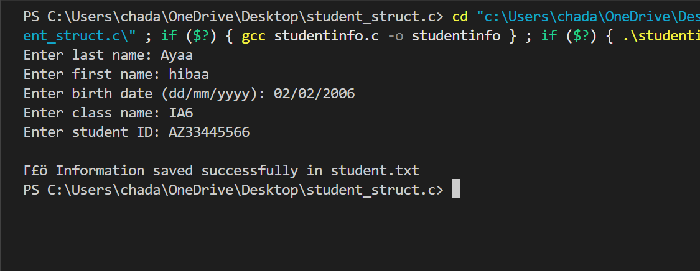

# Student Information Entry Program

This is a simple C program to store student information in a text file.

## Description

The program allows the user to input the following information about a student:

- Last Name
- First Name
- Birth Date (day, month, year)
- Class Name
- Student ID

Once entered, the information is saved to a file called `student.txt`.

## Features

- Accepts input from the user via the console.
- Validates file opening and displays an error if the file cannot be opened.
- Saves all student information in a structured format in `student.txt`.
- Provides a success message after saving.
## 📸 Project Screenshots
### 1/  Program Run Screenshot

### 2/  health_analysis

